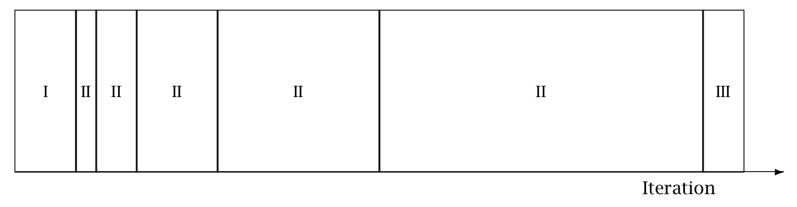

# MCMC Sampling {#hmc.chapter}

This chapter presents the two Markov chain Monte Carlo (MCMC)
algorithms used in Stan, the Hamiltonian Monte Carlo (HMC) algorithm
and its adaptive variant, the no-U-turn sampler (NUTS), along with
details of their implementation and configuration.  The default
sampler is NUTS with a diagonal mass matrix (more details below).


## Hamiltonian Monte Carlo

Hamiltonian Monte Carlo (HMC) is a Markov chain Monte Carlo (MCMC)
method that scales well in dimension due to its use of gradients of
the the log density function being sampled.  It uses an approximate
Hamiltonian dynamics simulation based on numerical integration which
is then corrected by performing a Metropolis acceptance step.

Gradients of the target log density function allow HMC to follow the
Hamiltonian flow in order to efficiently generate long-distance
proposals with high acceptance rates.  @Neal:2011 provides an
introduction to HMC, @Betancourt:2017 expands on the geometric
concepts and introduces the multinomial NUTS that Stan uses, and
@Bou-Rabee:2025 provides a more theoretical introduction with
correctness proofs for the version of NUTS introduced by
Betancourt:2017.

### Target density {-}

The goal of sampling is to draw from a density $p(\theta)$ for
parameters $\theta$.  This is typically a Bayesian posterior $p(\theta
\mid y)$ given data $y$, and in particular, a Bayesian posterior coded
as a Stan program.


### Auxiliary momentum variable {-}

HMC introduces auxiliary momentum variables $\rho$ and draws from a
joint density

$$
p(\rho, \theta) = p(\rho  \mid  \theta) p(\theta).
$$

In most applications of HMC, including Stan, the auxiliary density is
a multivariate normal that does not depend on the parameters $\theta$,

$$
\rho \sim \mathsf{MultiNormal}(0, M),
$$

where $M$ is a positive definite mass matrix.  The mass matrix
functions as a metric and is equivalent to having a linear
preconditioner; see @Betancourt:2017 for details.

Stan estimates a mass matrix during warmup using the covariance of the
warmup draws.  The mass matrix will be set to the inverse of the
covariance estimate of the warmup draws, or to the inverse of the
diagonal of the covariance estimate of the draws.  Using the inverse
covariance for a multivariate normal preconditions back to a standard
normal.  Mass matrix adaptation is much less effective when the
posterior curvature (i.e., the Hessian) varies through the target
density, as it does, for example, in hierarchical models without a lot
of data per level.

### The Hamiltonian {-}

The joint density $p(\rho, \theta)$ defines a Hamiltonian

$$
\begin{array}{rcl}
H(\theta, \rho) & = & - \log p(\rho, \theta)
\\[3pt]
& = & - \log p(\rho  \mid  \theta) - \log p(\theta).
\\[3pt]
& = & T(\rho  \mid  \theta) + V(\theta).
\end{array}
$$

The two terms into which it separates are treated in
the Hamiltonian dynamics as a a potential energy function defined by
$$
V(\theta) = - \log p(\theta),
$$
and a kinetic energy function defined by
$$
T(\rho) = - \log p(\rho  \mid  M).
$$
Here, $\log p(\rho \mid M) = \textrm{MultiNormal}(\rho \mid 0, M)$,
so that
$$
T(\rho) = \frac{1}{2} \rho^\top M^{-1} \rho + \textrm{const},
$$
where the constant does not depend on $\rho$, only on the fixed $M$.


### Generating transitions {-}

Starting from the current value of the parameters $\theta$, a
transition to a new state is generated in two stages before being
subjected to a Metropolis accept step.

First, a value for the momentum is drawn independently of the current
parameter values,
$$
\rho \sim \mathsf{MultiNormal}(0, M).
$$


As a consequence, momentum does not persist across iterations.

Next, the joint system $(\theta,\rho)$ made up of the current
parameter values $\theta$ and new momentum $\rho$ is evolved via
Hamilton's equations.  The momentum being independent of the target
density results in simple derivatives of the Hamiltonian,
$$
\dfrac{d \theta}{d t}  =  \dfrac{\partial}{\partial \rho} T(\rho)
$$
and
$$
\frac{d \rho}{d t}  =  -\dfrac{\partial}{\partial \theta} V(\theta).
$$


### Leapfrog integrator {-}

The last section leaves a two-state differential equation to solve.
Stan, like most other HMC implementations, uses the leapfrog
integrator, which is a numerical integration algorithm that's
specifically adapted to provide stable results for Hamiltonian systems
of equations.

Like most numerical integrators, the leapfrog algorithm takes discrete
steps of some small time interval $\epsilon$. The leapfrog algorithm
begins by drawing a fresh momentum term independently of the parameter
values $\theta$ or previous momentum value.

$$
\rho \sim \mathsf{MultiNormal}(0, M).
$$
It then alternates half-step updates of the momentum and full-step
updates of the position.

\begin{align}
\rho &\leftarrow
      \rho \, + \, \dfrac{\epsilon}{2} \, \nabla \, p(\theta \mid y)
\\[6pt]
\theta &\leftarrow
       \theta \, + \, \epsilon \, M^{-1} \, \rho
\\[6pt]
\rho &\leftarrow
     \rho \, - \, \dfrac{\epsilon}{2} \, \nabla \, p(\theta \mid y)
\end{align}

By applying $L$ leapfrog steps, a total of $t = L \cdot \epsilon$ time is
simulated. The resulting state at the end of the simulation ($L$
repetitions of the above three steps) will be denoted
$(\rho^{*}, \theta^{*})$.

The leapfrog integrator's error is on the order of $\epsilon^3$ per
step and $\epsilon^2$ globally, where $\epsilon$ is the time interval
(also known as the step size);  @LeimkuhlerReich:2004 provide a
detailed analysis of numerical integration for Hamiltonian systems,
including a derivation of the error bound for the leapfrog
integrator.


### Metropolis accept step {-}

If the leapfrog integrator were perfect numerically, there would no
need to do any more randomization per transition than generating a
random momentum vector. Instead, what is done in practice to account
for numerical errors during integration is to apply a Metropolis
acceptance step, where the probability of keeping the proposal
$(\rho^{*}, \theta^{*})$ generated by transitioning from
$(\rho, \theta)$ is

$$
\min\left(
1,
\dfrac{p(\theta^*, \rho)}{p(\theta, \rho)}
\right)
= 
\min \!
\left(
1,
\ \exp \! \left(\log p(\theta^*, \rho^*) - \log p(\theta, \rho) \right)
\right).
$$

If the proposal is not accepted, the previous parameter value is
returned for the next draw.


### Algorithm summary {-}

The Hamiltonian Monte Carlo algorithm starts at a specified initial
set of parameters $\theta$; in Stan, this value is either
user-specified or generated randomly. Then, for a given number of
iterations, a new momentum vector is Gibbs sampled (this step is
always accepted) and the current value of the parameter $\theta$ is
updated using Metropolis-within-Gibbs where the proposal is generated
using the leapfrog integrator with discretization time $\epsilon$ and
number of steps $L$ according to the Hamiltonian dynamics. Then a
Metropolis acceptance step is applied, and a decision is made whether
to update to the new state $(\theta^{*}, \rho^{*})$ or keep the
existing state.


## HMC algorithm parameters

The Hamiltonian Monte Carlo algorithm has three parameters which must
be set,

* discretization time $\epsilon$ (aka step size),
* metric $M$ (aka mass matrix), and
* number of steps taken $L$.

In practice, sampling efficiency, both in terms of iteration speed and
iterations per effective sample, is highly sensitive to these three
tuning parameters, as shown by @Hoffman-Gelman:2014.

If $\epsilon$ is too large, the leapfrog integrator will be inaccurate
and too many proposals will be rejected. If $\epsilon$ is too small,
too many small steps will be taken by the leapfrog integrator leading
to long simulation times per interval. Thus the goal is to balance the
acceptance rate between these extremes.

If $L$ is too small, the trajectory traced out in each iteration will
be too short and sampling will devolve to a random walk.  If $L$ is
too large, the algorithm will do too much work on each iteration.

If the inverse metric $M^{-1}$ is a poor estimate of the local
curvature at some point being visited on a Hamiltonian trajectory, the
step size $\epsilon$ must be kept small to maintain arithmetic
precision. This leads to a large $L$ to compensate, and can
dramatically slow down sampling.

### Integration time {-}

The actual integration time is $\epsilon \cdot L$, a function of number
of steps.  Some interfaces to Stan set an approximate integration time
$t$ and the discretization interval (step size) $\epsilon$.  In these
cases, the number of steps will be rounded down as

$$
L = \left\lfloor \frac{t}{\epsilon} \right\rfloor.
$$

and the actual integration time will still be $L \, \epsilon$.


### Automatic parameter tuning {-}

Stan is able to automatically optimize $\epsilon$ to match an
acceptance-rate target, able to estimate $M$ based on warmup
sample iterations, and able to dynamically adapt $L$ on the fly during
sampling (and during warmup) using the no-U-turn sampling (NUTS)
algorithm @Hoffman-Gelman:2014.

**Warmup Epochs Figure.** <a id="adaptation.figure"></a>
*Adaptation during warmup occurs in three stages:

- Stage I.  The initial adaptation window uses a unit mass matrix
and adapts step size to find the bulk of the probability mass.

- Stage II.  A series of expanding adaptation intervals (II) is
visited, with the draws generated during each used to estimate the
inverse mass matrix as the (diagonal of the) sample covariance.

- Stage III.  A final adaptation interval for fine-tuning step size.

Iteration numbering starts at 1 on the
left side of the figure and increases to the right.*



When adaptation is engaged (it may be turned off by fixing a step size
and metric), the warmup period is split into three stages, as
illustrated in the [warmup adaptation figure](#adaptation.figure),
with two *fast* intervals surrounding a series of growing
*slow* intervals. Here fast and slow refer to parameters that
adapt using local and global information, respectively; the
Hamiltonian Monte Carlo samplers, for example, define the step size as
a fast parameter and the (co)variance as a slow parameter. The size of
the the initial and final fast intervals and the initial size of the
slow interval are all customizable, although user-specified values may
be modified slightly in order to ensure alignment with the warmup
period.

The motivation behind this partitioning of the warmup period is to
allow for more robust adaptation. These intervals may be controlled
through the following configuration parameters, all of which must be
positive integers.

**Adaptation Parameters Table.**
*The parameters controlling adaptation and their default values.*

| parameter        | description                                   | default |
| :--------------- | :---------------------------------------------| :-----: |
| *initial buffer* | number of position adaptation steps           |   75    |
| *window*         | initial mass matrix adaptation interval size  |   25    |
| *term buffer*    | number of final step size adaptation steps    |   50    |

If a smaller total number of warmup iterations is given, these are scaled
down and at some point get so small that a warning is emitted when they
are unlikely to be sufficient to carry out reliable adaptation.


### Discretization-interval adaptation parameters {-}

As introduced by @Hoffman-Gelman:2014 for NUTS, Stan's HMC and NUTS
algorithms utilize the dual averaging algorithm of @Nesterov:2009 to
optimize the step size.^[This optimization of step size during
adaptation of the sampler should not be confused with running Stan's
optimization method.]

This warmup optimization procedure is extremely flexible and for
completeness, Stan exposes each tuning option for dual averaging,
using the notation of @Hoffman-Gelman:2014. In practice, the efficacy
of the optimization is sensitive to the value of these parameters, but
we do not recommend changing the defaults without experience with the
dual-averaging algorithm. For more information, see the discussion of
dual averaging in @Hoffman-Gelman:2014.

The full set of dual-averaging parameters are:

**Step Size Adaptation Parameters Table**
*The parameters controlling step size adaptation, with constraints and
default values.*

| parameter | description                       | constraint        | default |
| :-------: | :-------------------------------- | :---------------: | ------: |
|  `delta`  | target Metropolis acceptance rate | $[0, 1]$          |  0.80   |
|  `gamma`  | adaptation regularization scale   | $(0, \infty)$     |  0.05   |
|  `kappa`  | adaptation relaxation exponent    | $(0, \infty)$     |  0.75   |
|   `t_0`   | adaptation iteration offset       | $(0, \infty)$     | 10.00   |

By setting the target acceptance parameter $\delta$ to a value closer
to 1 (its value must be strictly less than 1 and its default value is
0.8), adaptation will be forced to use smaller step sizes. This can
improve sampling efficiency (effective sample size per iteration) at
the cost of increased iteration times. Raising the value of $\delta$
will also allow some models that would otherwise get stuck to overcome
their blockages.


### Step-size jitter {-}

All implementations of HMC use numerical integrators requiring a step
size (equivalently, discretization time interval). Stan allows the
step size to be adapted or set explicitly. Stan also allows the step
size to be "jittered" randomly during sampling to avoid any poor
interactions with a fixed step size and regions of high curvature. The
jitter is a proportion that may be added or subtracted, so the maximum
amount of jitter is 1, which will cause step sizes to be selected in
the range of 0 to twice the adapted step size. The default value is 0,
producing no jitter.

Small step sizes can get HMC samplers unstuck that would otherwise get
stuck with higher step sizes. The downside is that jittering below the
adapted value will increase the number of leapfrog steps required and
thus slow down iterations, whereas jittering above the adapted value
can cause premature rejection due to simulation error in the
Hamiltonian dynamics calculation. @Neal:2011 discusses step-size
jittering.

Another benefit of jittering is that it can break harmonics that arise
from unfortunate choices of integration time that lead to half orbits
or full orbits around the posterior (the former being bad for variance
estimation and the latter for all estimation).


### The Euclidean metric (aka mass matrix) {-}

All HMC implementations in Stan utilize quadratic kinetic energy
functions which are specified up to the choice of a symmetric,
positive-definite matrix known as a *mass matrix* or, viewed from
a more geometric angle, a *metric*.

If the metric is constant then the resulting implementation is known
as *Euclidean* HMC (in contrast to the Riemannian HMC of
@GirolamiCalderhead:2011, which is not exposed in any of Stan's
interfaces). Stan allows a choice among three Euclidean HMC
implementations,

* a unit metric (diagonal matrix of ones),
* a diagonal metric (diagonal matrix with positive diagonal entries), and
* a dense metric (a dense, symmetric positive definite matrix).

to be configured by the user.

If the metric is specified to be diagonal, then regularized
variances are estimated based on the iterations in each slow-stage
block (labeled II in the [warmup adaptation stages
figure](#adaptation.figure)).  Each of these estimates
is based only on the iterations in that block.  This allows early
estimates to be used to help guide warmup and then be forgotten later
so that they do not influence the final covariance estimate.

If the metric is specified to be dense, then regularized
covariance estimates will be carried out, regularizing the estimate to
a diagonal matrix, which is itself regularized toward a unit matrix.

Variances or covariances are estimated using Welford accumulators to
minimize dynamic memory overhead and to avoid a loss of precision over
many floating point operations.


#### Warmup times and estimating the metric {-}

The metric can compensate for linear (i.e. global) correlations
in the posterior which can dramatically improve the performance of HMC
in some problems. This requires knowing the global correlations.

In complex models, the global correlations are usually difficult, if
not impossible, to derive analytically; for example, nonlinear model
components convolve the scales of the data, so standardizing the data
does not always help.  Therefore, Stan estimates these correlations
online with an adaptive warmup.  In models with strong nonlinear
(i.e. local) correlations this learning can be slow, even with
regularization. This is ultimately why warmup in Stan often needs to
be so long, and why a sufficiently long warmup can yield such
substantial performance improvements.


#### Nonlinearity {-}

The metric compensates for only linear (equivalently global or
position-independent) correlations in the posterior. The hierarchical
parameterizations, on the other hand, affect some of the nasty
nonlinear (equivalently local or position-dependent) correlations
common in hierarchical models.^[In Riemannian HMC the metric compensates for nonlinear correlations.]

One of the biggest difficulties with dense metrics is the
estimation of the metric itself which introduces a bit of a
chicken-and-egg scenario;  in order to estimate an appropriate metric
for sampling, convergence is required, and in order to
converge, an appropriate metric is required.

#### Dense vs. diagonal metrics {-}

Statistical models for which sampling is problematic are not typically
dominated by linear correlations for which a dense metric can
adjust.  Rather, they are governed by more complex nonlinear
correlations that are best tackled with better parameterizations or
more advanced algorithms, such as Riemannian HMC.

#### Warmup times and curvature {-}

MCMC mixing time (e.g., the time to converge to the bulk of the
probability mass from a random initialization) is proportional to
autocorrelation time and of the same order.  Because HMC (and NUTS)
chains tend to have low autocorrelation, they tend to converge quite
rapidly to the bulk of the probability mass.  It will then be roughly
the same amount of work to generate each new roughly independent
draw.

Warmup times being vast only holds when the posterior is log concave,
and ideally almost normal.  This assumption is violated in the kind of
complex, real-world models to which Stan is typically applied.  Quite
often, the tails have large curvature while the bulk of the posterior
mass is relatively well-behaved; in other words, warmup is slow not
because the actual convergence time is slow but rather because the
cost of an HMC iteration is more expensive out in the tails.

Poor behavior in the tails is the kind of pathology that can be
uncovered by running only a few warmup iterations. By looking at the
acceptance probabilities and step sizes of the first few iterations
provides an idea of how bad the problem is and whether it must be
addressed with modeling efforts such as tighter priors or
reparameterizations.


### NUTS and its configuration {-}

The no-U-turn sampler (NUTS) automatically selects an appropriate
number of leapfrog steps in each iteration in order to allow the
proposals to traverse the posterior without doing unnecessary work.
The motivation is to maximize the expected squared jump distance (see,
e.g., @RobertsEtAl:1997) at each step and avoid the random-walk
behavior that arises in random-walk Metropolis or Gibbs samplers when
there is correlation in the posterior.  @Hoffman-Gelman:2014 developed
the original NUTS algorithm and provided a sketch of detailed balance
(i.e., a demonstration that it has the correct stationary distribution
and is thus sampling from the correct target).  @Betancourt:2017
presents the multinomial improvement of NUTS used in Stan and
@Bou-Rabee:2025 provide a complete presentation and a proof of
correctness.

NUTS generates a proposal by starting at an initial position
determined by the parameters drawn in the last iteration.  Like HMC,
it starts by Gibbs sampling a a random momentum vector with covariance
determined by the mass matrix.  It then iteratively doubles the length
of the trajectory, moving in a random direction in time (forward or
backward) at each doubling.  It stops the doubling when it encounters
a U-turn between the start and end (in time) of the trajectory.  A
U-turn arises when an infinitesimal extension of the trajectory has
the ends moving closer to each other.  It also stops doubling if a
maximum number of doublings is achieved (maximum 10 by default, for a
total of 1024 leapfrog steps).

One way to formulate a valid version of NUTS, which
@Hoffman-Gelman:2014 called "naive NUTS", is to select the next state
from among all the states in the trajectory proportional to its
density.  This can also be done for basic HMC with just a fixed
trajectory in a single direction [@Bou-Rabee:2025].  In the original
version of NUTS this was carried out with slice sampling, which is
less efficient than the multinomial version introduced by
@Betancourt:2017.

The full (non-naive) version of NUTS introduces biased-progressive
sampling.  Rather than just sampling along the trajectory proportional
to its density, this is done for each doubling.  That is, as each new
doubling is introduced, a point is sampled from along that trajectory
with probability proportional to its density.  Then there is a
Metropolis step to determine if the currently selected point (which
starts as the initial point) is selected or if the sample moves to the
new doubling.  This is done with a Metropolis acceptance ratio
consisting of the sum of the densities in the new doubling divided by
the sum of the densities in the current trajectory.  Because these are
the same length and the Hamiltonian should be preserved, the
probabability of jumping to the new doubling is close to 1 when the
leapfrog algoritm is stable.

Configuring the no-U-turn sample involves putting a cap on the depth
of the trees that it evaluates during each iteration, as well as
choosing a step size and mass matrix, both of which can be adapted
during warmup.

Both the number of doublings (aka tree depth when they are arranged in
a binary tree) and the actual number of leapfrog steps computed are
reported along with the parameters in the output as `treedepth__` and
`n_leapfrog__`, respectively. Because the final subtree may only be
partially constructed (it can be rejected due to a sub-U-turn before
being fully built), these two will always satisfy

$$
2^{\mathrm{treedepth} - 1} - 1
\ < \
N_{\mathrm{leapfrog}}
\ \le \
2^{\mathrm{treedepth} } - 1.
$$

Tree depth is an important diagnostic tool for NUTS. For example, a
tree depth of zero occurs when the first leapfrog step is immediately
rejected and the initial state returned, indicating a step size too
large for the local curvature (i.e., the first-order approximation
from the gradient breaks down).  On the other hand, a tree depth equal
to the maximum depth indicates that NUTS is taking many leapfrog steps
and being terminated prematurely to avoid excessively long execution
time. Taking very many steps is usually a sign of adapting a small
step size for high-curvature regions that then needs to take many
steps in low-curvature regions.  Both of these problems can be tackled
by reparameterization, but that involves geometric considerations and
can be very problem specific.  In the rare cases where the model is
correctly specified and a large number of steps is necessary, the
maximum depth should be increased to ensure that that the NUTS tree
can grow as large as necessary to not prematurely terminate, as that
will be more efficient than the diffusive behavior induced by early
termination.

## Sampling without parameters

In some situations, such as pure forward data simulation in a directed
graphical model (e.g., where you can work down generatively from known
hyperpriors to simulate parameters and data), there is no need to
declare any parameters in Stan, the model block will be empty (and thus
can be omitted), and all output quantities will be produced in the
generated quantities block.

For example, to generate a sequence of $N$ draws from a binomial with
trials $K$ and chance of success $\theta$, the following program suffices.

```stan
data {
  real<lower=0, upper=1> theta;
  int<lower=0> K;
  int<lower=0> N;
}
generated quantities {
  array[N] int<lower=0, upper=K> y;
  for (n in 1:N) {
    y[n] = binomial_rng(K, theta);
  }
}
```

For this model, the sampler must be configured to use the fixed-parameters
setting because there are no parameters.  Without parameter sampling there
is no need for adaptation and the number of warmup iterations should be set to
zero.

Most models that are written to be sampled without parameters will not
declare any parameters, instead putting anything parameter-like in the
data block. Nevertheless, it is possible to include parameters for
fixed-parameters sampling and initialize them in any of the usual ways
(randomly, fixed to zero on the unconstrained scale, or with
user-specified values). For example, `theta` in the example above
could be declared as a parameter and initialized as a parameter.


## General configuration options {#general-config.section}

Stan's interfaces provide a number of configuration options that are
shared among the MCMC algorithms (this chapter), the [optimization
algorithms chapter](optimization.qmd), and the
[diagnostics chapter](diagnostics.qmd).


### Random number generator {-}

The random-number generator's behavior is fully determined by the
unsigned seed (positive integer) it is started with. If a seed is not
specified, or a seed of 0 or less is specified, the system time is
used to generate a seed. The seed is recorded and included with Stan's
output regardless of whether it was specified or generated randomly
from the system time.

Stan also allows a chain identifier to be specified, which is useful
when running multiple Markov chains for sampling. The chain identifier
is used to advance the random number generator a very large number of
random variates so that two chains with different identifiers draw
from non-overlapping subsequences of the random-number sequence
determined by the seed.  When running multiple chains from a single
command, Stan's interfaces will manage the chain identifiers.


#### Replication {-}

Together, the seed and chain identifier determine the behavior of the
underlying random number generator.  For complete reproducibility,
every aspect of the environment needs to be locked down from the OS
and version to the C++ compiler and version to the version of Stan and
all dependent libraries.


### Initialization {-}

The initial parameter values for Stan's algorithms (MCMC,
optimization, or diagnostic) may be either specified by the user or
generated randomly. If user-specified values are provided, all
parameters must be given initial values or Stan will abort with an
error message.


#### User-defined initialization {-}

If the user specifies initial values, they must satisfy the
constraints declared in the model (i.e., they are on the constrained
scale).


#### System constant zero initialization {-}

It is also possible to provide an initialization of 0, which causes
all variables to be initialized with zero values on the unconstrained
scale. The transforms are arranged in such a way that zero
initialization provides reasonable variable initializations for most
parameters, such as 0 for unconstrained parameters, 1 for parameters
constrained to be positive, 0.5 for variables to constrained to lie
between 0 and 1, a symmetric (uniform) vector for simplexes, unit
matrices for both correlation and covariance matrices, and so on.


#### System random initialization {-}

Random initialization by default initializes the parameter values with
values drawn at random from a $\mathsf{Uniform}(-2, 2)$ distribution.
Alternatively, a value other than 2 may be specified for the absolute
bounds. These values are on the unconstrained scale, so must be
inverse transformed back to satisfy the constraints declared for
parameters.

Because zero is chosen to be a reasonable default initial value for
most parameters, the interval around zero provides a fairly diffuse
starting point. For instance, unconstrained variables are initialized
randomly in $(-2, 2)$, variables constrained to be positive are
initialized roughly in $(0.14, 7.4)$, variables constrained to fall
between 0 and 1 are initialized with values roughly in $(0.12, 0.88)$.


## Divergent transitions

The Hamiltonian Monte Carlo algorithms (HMC and NUTS) simulate the
trajectory of a fictitious particle representing parameter values when
subject to a potential energy field, the value of which at a point is
the negative log posterior density (up to a constant that does not
depend on location).  Random momentum is imparted independently in
each direction, by drawing from a standard normal distribution.  The
Hamiltonian is defined to be the sum of the potential energy and
kinetic energy of the system. The key feature of the Hamiltonian is
that it is conserved along the trajectory the particle moves.

In Stan, we use the leapfrog algorithm to simulate the path of a
particle along the trajectory defined by the initial random momentum
and the potential energy field.  This is done by alternating updates
of the position based on the momentum and the momentum based on the
position.  The momentum updates involve the potential energy and are
applied along the gradient.  This is essentially a stepwise
(discretized) first-order approximation of the trajectory.
@LeimkuhlerReich:2004 provide details and error analysis for the
leapfrog algorithm.

A divergence arises when the simulated Hamiltonian trajectory departs
from the true trajectory as measured by departure of the Hamiltonian
value from its initial value.  When this divergence is too high,^[The current default threshold is a factor of $10^3$, whereas when the leapfrog integrator is working properly, the divergences will be around $10^{-7}$ and do not compound due to the symplectic nature of the leapfrog integrator.]
the simulation has gone off the rails and cannot be trusted.  The
positions along the simulated trajectory after the Hamiltonian
diverges will never be selected as the next draw of the MCMC
algorithm, potentially reducing Hamiltonian Monte Carlo to a simple
random walk and biasing estimates by not being able to thoroughly
explore the posterior distribution.  @Betancourt:2016b provides
details of the theory, computation, and practical implications of
divergent transitions in Hamiltonian Monte Carlo.

The Stan interfaces report divergences as warnings and provide ways to
access which iterations encountered divergences.  ShinyStan provides
visualizations that highlight the starting point of divergent
transitions to diagnose where the divergences arise in parameter
space.  A common location is in the neck of the funnel in a centered
parameterization, an example of which is provided in the user's guide.

If the posterior is highly curved, very small step sizes are required
for this gradient-based simulation of the Hamiltonian to be accurate.
When the step size is too large (relative to the curvature), the
simulation diverges from the true Hamiltonian.  This definition is
imprecise in the same way that stiffness for a differential equation
is imprecise; both are defined by the way they cause traditional
stepwise algorithms to diverge from where they should be.

The primary cause of divergent transitions in Euclidean HMC (other
than bugs in the code) is highly varying posterior curvature, for
which small step sizes are too inefficient in some regions and diverge
in other regions.  If the step size is too small, the sampler becomes
inefficient and halts before making a U-turn (hits the maximum tree
depth in NUTS); if the step size is too large, the Hamiltonian
simulation diverges.


### Diagnosing and eliminating divergences {-}

In some cases, simply lowering the initial step size and increasing
the target acceptance rate will keep the step size small enough that
sampling can proceed. In other cases, a reparameterization is required
so that the posterior curvature is more manageable; see the funnel
example in the user's guide for an example.

Before reparameterization, it may be helpful to plot the posterior
draws, highlighting the divergent transitions to see where they arise.
This is marked as a divergent transition in the interfaces; for
example, ShinyStan and RStan have special plotting facilities to
highlight where divergent transitions arise.

