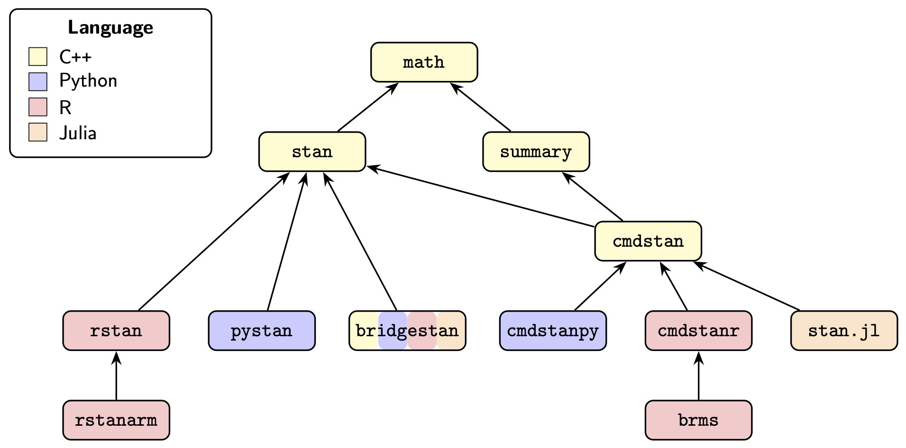

# The Stan Ecosystem {#ecosystem.chapter}

Stan is a domain-specific programming language for specifying
probabilistic models along with a collection of algorithms for
performing statistical inference and analyzing model fits.

## What is the *Stan User's Guide*?

This document, the *Stan User's Guide*, is intended to explain
techniques for statistical modeling using the Stan modeling language.
As such, it concentrates on the Stan language itself and does *not*
discuss any of the Stan interfaces that are required to actually
use Stan (see below).

## Who uses Stan?

You can find Stan users and example code online from almost
every subfield of science and most branches of statistics other than
highly non-parametric modeling (e.g., neural networks,
high-dimensional Dirichlet processes), highly coupled discrete models
(e.g., Ising models), huge scale (e.g., e-commerce, global weather
models), and real-time processing (e.g., quad-copter control).

Stan applications have been drawn from pretty much every branch of
biological science (from cellular to population ecology and zoology),
physical sciences (from quantum to astro), social sciences
(psychometrics, surveys, economics, and anthropology), engineering
(from civil to mechanical), educational sciences (testing), medical
sciences (from epidemiology to clinical trials), sports statistics
(pretty much every major sport, plus bookmaking), finance (asset
pricing, risk assessment, forecasting), business (advertising
attribution, demand and pricing), and actuarial sciences.

## Stan user and developer communities

Stan's strongest feature is its active community of users.  Stan's
users hail from a wide range of mathematical and statistical
backgrounds and work in a broad range of application areas.

The primary Stan discussion board is hosted by Discourse.

* [Stan Forums](https://discourse.mc-stan.org), where users and
  developers discuss issues with Stan and its applications.  

The Stan developers discuss designs, plans, and communicate with each
other through the forums and also on GitHub.  Users can also access it
and make feature requests or report bugs.

* [Stan GitHub](https://github.com/stan-dev), which tracks issues and
  contains the complete source code for Stan (the core is licensed
  under BSD-3).

Both developers and users attend Stan conferences, which are a mix
of tutorials, talks about applications, and talks from the Stan
developers about where Stan is going.

* [StanCon](https://mc-stan.org/learn-stan/stancon-talks.html), which is
  where you'll find the talks, slides, and executable notebooks.

## How is the Stan project organized?

Stan is free open source software released under permissive licenses
(BSD-3 for the core code).  There are no institutional owners and no
institutional oversight of the project.

The Stan project as a whole is managed through the <a
href="https://mc-stan.org/about/#stan-governance">Stan Governing
Body</a> (SGB), who have final say on all things Stan related. They
also organize StanCon.  The members are elected by the developers and
rotate through short (1--2 year) terms.

Software development is managed through <a
href="https://www.apache.org/foundation/voting.html">Apache-style
voting</a> among the developers.  Lack of consensus is so rare there
have only been a few votes in the history of the project aside from
electing SGB members.

Since development of Stan began in 2011 (the first release was in
2012), funding has been provided through governmental grants across
multiple agencies in several countries, through non-profit
foundations, through universities, through donations from
corporations, and through in-kind donations of time by our developer's
employers.  Thank you!

## Stan documentation

### Core Stan documentation

Stan's internal documentation is organized through a top-level web
page.

* [Stan documentation](https://mc-stan.org/docs/)

You are currently reading the *Stan User's Guide*, which is complemented by
the *Reference Manual* and *Functions Reference*.  These are all
interface-agnostic guides to the Stan language and its execution.
They are available online with integrated navigation and also as pdfs.

* [*Stan Users' Guide*](https://mc-stan.org/docs/stan-users-guide/)

* [*Stan Reference
  Manual*](https://mc-stan.org/docs/reference-manual/)

* [*Stan Functions Reference*](https://mc-stan.org/docs/functions-reference/)

### Stan case studies

Stan case studies cover specific models or techniques with reproducible
code (usually in Python or R).  They can be found in the devoted page of
case studies or through StanCon presentations.

* [*Stan Case Studies*](https://mc-stan.org/learn-stan/case-studies.html)

* [*StanCon Case Studies*](https://mc-stan.org/learn-stan/stancon-talks.html)

### Stan GitHub organization

{#fig-stan-projects width=75% fig-align="center"}

The projects shown in @fig-stan-projects are just the tip of the iceberg.
Stan is organized into more than fifty code repositories, all of which can
be found in one place.

* GitHub organization for Stan's source code and documentation: [`stan-dev`](https://github.com/stan-dev)

The core Stan code repository not included int he diagram is the language itself,
which is at the following location.

* `stanc3` (OCaml): Stan language transpiler (parser, intermediate representation, C++ code generator)

The prominent R packages not included in the diagram are the
following.

* `posterior` (R): posterior analysis tools
* `bayesplot` (R): plotting tools
* `loo` (R): approximate leave-one out cross-validation
* `rstantools` (R): tools for developing R packages interfacing with Stan
* `shinystan` (R): dashboard for exploring Stan model fits

Stan's core documentation is also maintained on GitHub, with
package-specific documentation maintained in the same repository as
the code.

* `docs` (Quarto markdown): where this document's source is hosted
* `design-docs` (GitHub markdown): where the developers discuss designs
* `stan-dev.github.io` (Markdown, YAML): mc-stan.org web site

Stan's syntax highlighters are on GitHub.

* `atom-language-stan` (Atom): syntax highlighting and autocomplete for the Stan language
* `stan-mode` (emacs lisp): indentation and highlighting in emacs

The Stan developers also curate a repository of test programs
available as text and data files or through with programmatic
interfaces.

* `posteriordb` (R, Python, Stan, PyMC): example models with reference draws and R and Python interfaces for access

### Stan interface documentation

CmdStan is the reference implementation of Stan and is coded entirely in C++.

* Command line: [*CmdStan User's Guide*](https://mc-stan.org/docs/cmdstan-guide/)

CmdStanPy, CmdStanR, and Stan.jl make system calls to CmdStan out of
process.

* Python:  [*CmdstanPy Users's Guide*](https://mc-stan.org/cmdstanpy/)

* R: [*CmdStanR Users' Guide*](https://mc-stan.org/cmdstanr/)

* Julia: [*Stan.jl Interface User's Guide*](http://stanjulia.github.io/Stan.jl/stable/INTRO/)

PyStan and RStan call Stan code directly through C++.

* Python: [*PyStan User's Guide*](https://pystan.readthedocs.io/en/latest/)

* R: [*RStan User's Guide*](https://mc-stan.org/rstan/)

BridgeStan is the cross-platform interface for accessing Stan language
components, including (unconstrained) log densities, gradients, and
Hessians, as well as parameter transformations and the posterior
predictive simulations required for generated quantities.

* Python, R, C, Rust: [*BridgeStan User's Guide*](https://roualdes.us/bridgestan/latest/)

BridgeStan is implemented through low-level foreign function
interfaces that link to the compiled C++ class for a Stan program and
the Stan math library.

In addition to the documentation maintained by the development team, there
are many resources available online from the community including books,
video courses, talks, papers, and case studies.  

## What is Stan?

Stan is made up of a programming language for statistical models,
several integrated statistical inference algorithms, and interfaces in
various higher-level analysis languages (R, Python, Julia, Stata,
MATLAB).  The Stan project also maintains higher-level interfaces to
Stan such as the `rstanarm` and `brms`, both of which are based on R's
expression language for regressions.  The project also develops and
maintains visualization and model comparison tools like `posterior`
and `loo` (in R; for Python, similar functionality is available through
`ArviZ`).

Many other individuals and companies have built tools that depend on
the core Stan language or packages, many of which are available open
source.  These handle everything from compartment
pharmacometric/pharmacodynamic models (`torsten`) to structural
equation models (`blavaan`) to general additive models for time series
(`prophet`).

### Stan programming language

Stan provides a domain-specific language for specifying smooth,
data-dependent target density functions on the logarithmic scale.  For
Bayesian applications, this will be the posterior log density function
(up to an additive constant).  For frequentist applications, it will
be a penalized likelihood function. Stan also provides a method for
efficiently coding posterior predictive quantities through simulation.

Stan is a differentiable programming language, meaning that Stan can
automatically take first, second, and even higher-order derivatives of
any log density it defines.  Stan is also a probabilistic programming
language in that its variables represent random variables and
constants (at least when viewed from the Bayesian perspective).

Stan provide syntax highlighting through an `atom` specification.
Downstream tools using syntax highlighting for Stan include GitHub,
RStudio, VS Code, Jupyter notebooks, Emacs, Neovim, etc.

### Stan inference engines

Stan supports inference for probability models through general,
model-agnostic sampling techniques including the following two Markov
chain Monte Carlo (MCMC) methods.

* Hamiltonian Monte Carlo (HMC)
* No-U-Turn Sampler (NUTS)

Stan also includes the following two approximate inference
techniques based on variational inference,

* Automatic Differentiation Variational Inference (ADVI)
* Pathfinder variational inference

It also supplies an approximate method based on optimization and curvature.

* Laplace approximation

Finally, Stan supplies industry-standard optimization methods, which
can be used for maximum likelihood estimates and as the basis for
Laplace approximations.

* Newton, BFGS, and L-BFGS optimization

Stan can estimate confidence intervals through the bootstrap as
explained in the posterior inference and model checking part of this
document.

### Stanc3: Stan-to-C++ transpilation

Stan uses a standard programming language stack of parser,
intermediate representation layer, and code generator.  These are all
written in the OCaml programming language.  The code generator
produces a C++ class implementing the model defined by the Stan
program.  It is this latter feature, targeting an intermediate
language rather than assembly/machine language, which makes it a
transpiler rather than a compiler.

### Stan math library

The C++ class produced by the `stanc3` transpiler depends on the Stan
Math Library.  The math library implements differentiable arithmetic
operations, matrix and linear algebra operations, special mathematical
functions, and special statistical functions.  The Stan math library
itself has four dependencies in addition to C++ itself,

* `tbb`:  Intel Thread Building Blocks for thread management including
pools and synchronization,

* `boost`: Boost for general C++ tooling, special functions, random
number generators, and densities.

* `Eigen`: Eigen for templated general matrix operations and linear
  algebra solvers, and

* `sundials`: Sundials for differential equation solvers.

The math library can call out to GPU for some operations (e.g.,
Cholesky factorization or matrix-matrix multiplication), but overall,
it has been much more heavily optimized for CPUs.  When using GPUs,
there is a further dependency.

* `OpenCL`: OpenCL for GPU management.

## Background reading on Bayesian Statistics and Stan

This section links some resources for getting started with Bayesian
statistics using Stan.  The first two recommendations are for
introductions to Bayesian statistics using Stan, a complete hands-on
introductory textbook and shorter introductory article.

* [_Statistical Rethinking: A Bayesian Course with Examples in R and Stan_, Second Edition](https://xcelab.net/rm/). 2020. Richard McElreath. CRC Press.

* [Getting started with Bayesian statistics using Stan and Python](https://bob-carpenter.github.io/stan-getting-started/stan-getting-started.html). 2023. Bob Carpenter.

The next step to understanding Bayesian statistics more deeply after
these introductory texts is *BDA3*, a free pdf for which is available
from the linked web site.

* [_Bayesian Data Analysis, Third Edition_](https://sites.stat.columbia.edu/gelman/book/). 2013.  Andrew Gelman, John Carlin, Hal Stern, David Dunson, Aki Vehtari, and Donald Rubin. CRC Press.

Model building and inference, as supplied by Stan, are only two pieces
in a bigger toolchain needed for effective applied statistical
modeling.  The bigger picture extends to exploratory data analysis,
model construction and choice, algorithm calibration checking, prior
and posterior predictive checking, plotting and visualization, and
results presentation.  The following short article and book provide
advice on this broader statistical workflow from a Bayesian
perspective with worked examples in Stan.

* [Statistical workflow](https://sites.stat.columbia.edu/gelman/research/published/Statistical_Workflow_article.pdf). 2026. Andrew Gelman, Aki Vehtari, Richard McElreath. _Philosophical Transactions of the Royal Society A_.

* [_Bayesian Workflow_](https://avehtari.github.io/Bayesian-Workflow/). 2026. Andrew Gelman, Aki Vehtari, Richard McElreath, Daniel Simpson, Charles C. Margossian, Yuling Yao, Lauren Kennedy, Jonah Gabry, Paul-Christian Bürkner, Martin Modrák, Vianey Leos Barajas. Cambridge University Press.
