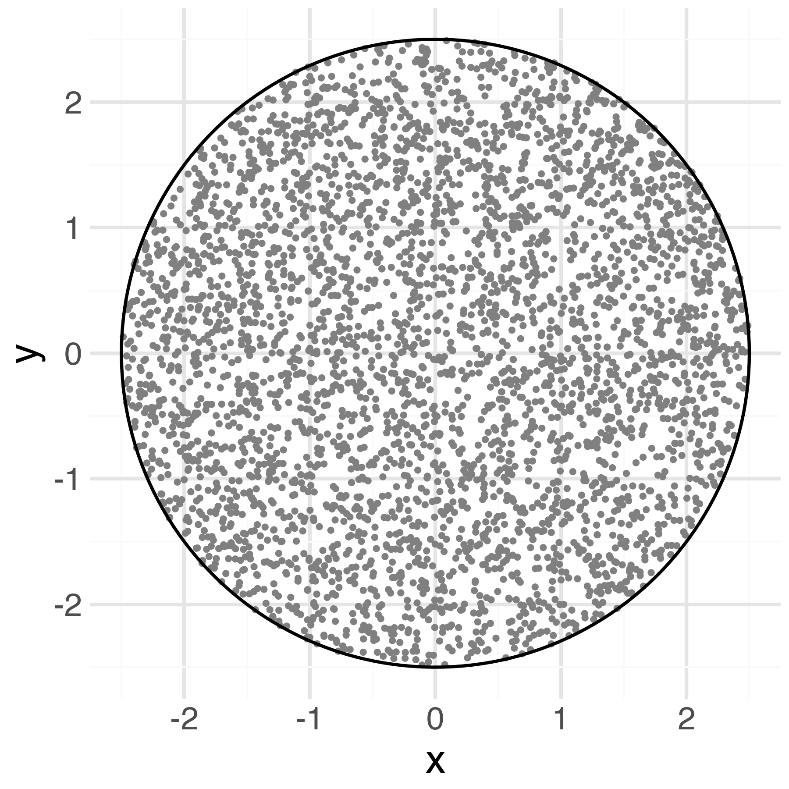
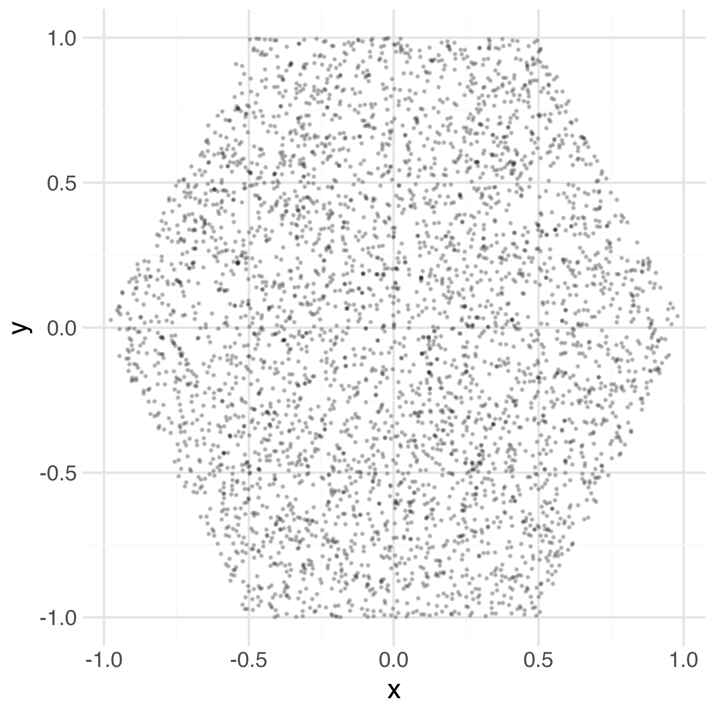
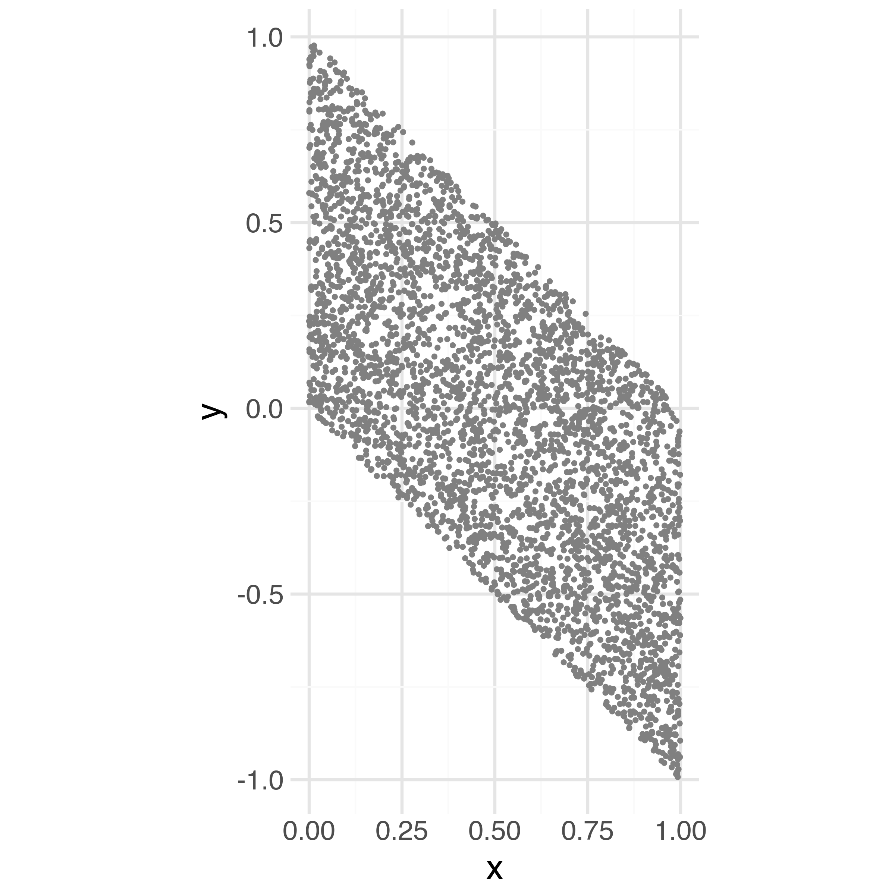
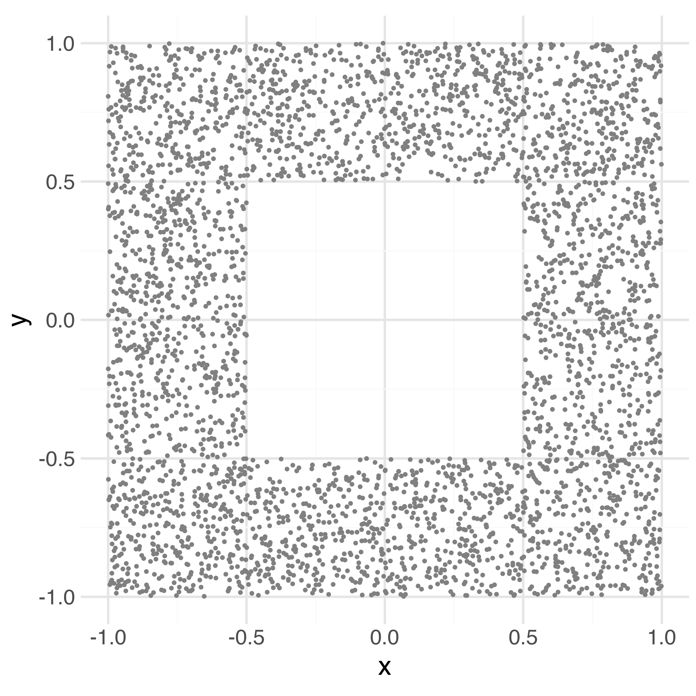
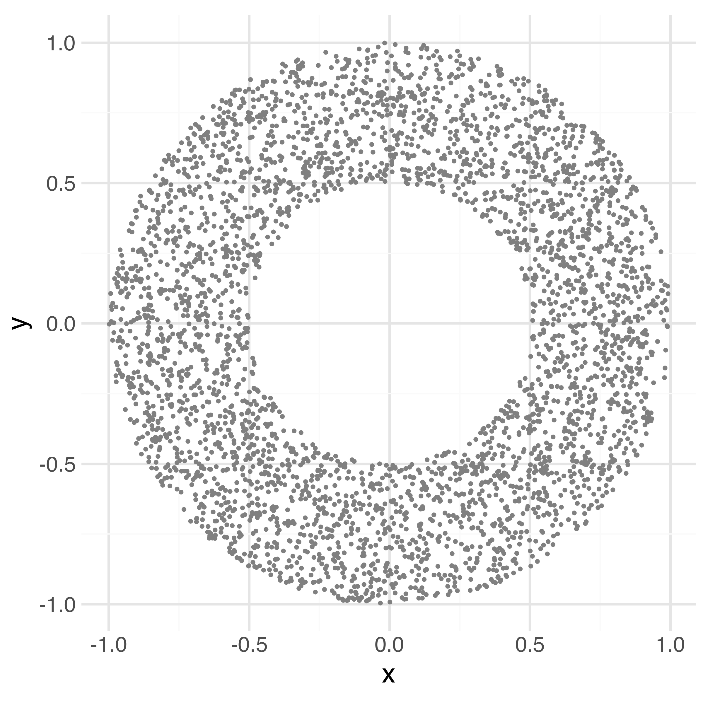
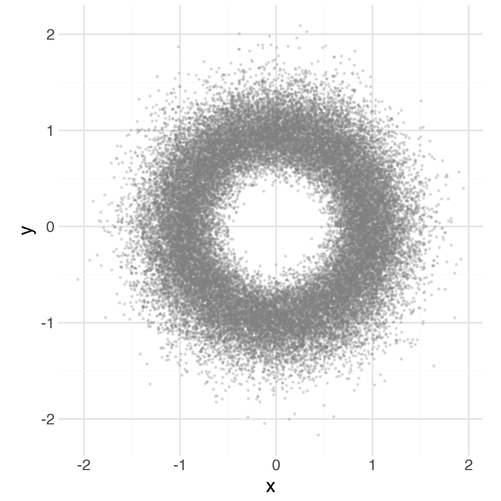

# Coding Unusual Constraints

## Matrices matching known margins

Suppose there is an $M \times N$ matrix $X$ marginals are known but
entries are unknown.  A normalized outer product and Stan's
sum-to-zero matrix type define an improper uniform distribution over
matrices with specified marginals.

Let $r \in \mathbb{R}^M$ be the row sums and $c \in \mathbb{R}^N$ be
the column marginals.  There is only a solution if $\textrm{sum}(r) =
\textrm{sum}(c)$. A baseline solution is given by the outer product of
the vector of row marginals and the vector of normalized column
marginals,
$$
E = r \cdot c^\top / \textrm{sum}(c),
$$
so that $E_{m,n} = r_m \cdot c_n / \textrm{sum}(c).$

To see that this is indeed a solution, consider the row $E_m$
and its marginal,

\begin{align*}
\textrm{sum}(E_m)
&= E_{m,1} + \cdots + E_{m, N}
\\[4pt]
&= r_m \cdot \frac{c_1}{\textrm{sum}(c)}
 + \cdots
 + r_m \cdot \frac{c_N}{\textrm{sum}(c)}
\\
&= r_m \cdot \frac{c_1 + \cdots + c_N}{\textrm{sum}(c)}
\\
&= r_m.
\end{align*}

The rows check out and the columns $E_{, n}$ also have the correct
marginal, which can be shown by noting that $\textrm{sum}(c) =
\textrm{sum}(r)$ if the input is coherent and then expanding
the sum,

\begin{align*}
\textrm{sum}(E_{, n})
&= E_{1, n} + \cdots + E_{M, n}
\\[4pt]
&= r_1 \cdot c_n / \textrm{sum}(c)
+ \cdots
+ r_M \cdot c_n / \textrm{sum}(c)
\\[4pt]
&= c_n \cdot (r_1 + \cdots + r_M) / \textrm{sum}(c)
\\[4pt]
&= c_n \cdot (r_1 + \cdots + r_M) / \textrm{sum}(r)
\\[4pt]
&= c_n.
\end{align*}

The Stan program is going to take $E$ as a constant mean, then take a sum-to-zero
matrix as a perturbation.  By itself, this is not identified, but it will be with
a prior on the entries in the sum-to-zero matrix.

```stan
data {
  int<lower=1> M;
  int<lower=1> N;
  vector[M] row_sums;
  row_vector[N] col_sums;
  real<lower=0> sigma;
}
transformed data {
  matrix[M, N] E = row_sums * (col_sums / sum(col_sums));
}
parameters {
  sum_to_zero_matrix[M, N] Z; 
}
transformed parameters {
  matrix[M, N] x = E + Z;
}
model {
  to_vector(D) ~ normal(0, sigma);
}
```


## Fun shapes

The title and many of the examples in this section are ported to Stan from
the chapter "Fun Shapes" in the BUGS examples
[@spiegelhalter2003bugs].

### The disc

Suppose we want parameters $(x, y)$ that have a uniform distribution
within a disc of radius $r > 0$?  This kind of constraint is easy to
parameterize by leaning on Stan's built-in constraints.

```stan
data {
  real<lower=0> r;
}
transformed data {
  real<lower=0> r_squared = r^2;
}
parameters {
  real<lower=-r, upper=r> x;
  real<lower=-sqrt(r_squared - square(x)), upper=sqrt(r_squared - square(x))> y;
}
```

The $x$ value is free to float anywhere in $(-r, r)$.  Conditional on
the $x$ value, $y$ must satisfy $x^2 + y^2 < r^2$, or $|y| < \sqrt{r^2
- x^2}$.  Because the constraint involvs the parameter `x`, the
combined adjustment does the right thing and assumes that jointly, `x`
and `y` have a uniform distribution within the disc.  The scatterplot
of draws shown in @fig-disc-scatterplot verifies that the distribution
is indeed uniform.

{#fig-disc-scatterplot width=50%}

The easy way to generate parameters in a disc is to simply scale
the built-in unit vector.  This has the nice property of easily
extending to higher dimensions, like points within a sphere and
having built-in change-of-variables adjutsments.

```stan
data {
  real<lower=0> r;
}
parameters {
  unit_vector[2] xy_unit;
}
transformed parameters {
  real<lower=-r, upper=r> x = r * xy_unit[1];
  real<lower=-r, upper=r> y = r * xy_unit[2];
}
```

The hard way to generate parameters within a disc is with an angle and
a radius.  We can uniformly generate the angle in $(0, 2\pi)$, then
generate a radius in $(0, r)$. First, we have to map the angle and radius
to $(x, y)$ coordinates by
$$
x, y = \rho \cdot \cos \theta, \rho \cdot \sin \theta.
$$
The transform is non-linear, so it requires a change-of-variabes adjustment (absolute value of
the determinant of the Jacobian of the transform).  The Jacobian matrix is
$$
J_{f^{-1}} = \begin{bmatrix}
\cos \theta & - \rho \cdot \sin \theta
\\
\sin \theta & \rho \cdot \cos \theta
\end{bmatrix}.
$$
After some algebra, the absolute determinant reduces to \left|\, \det
J_{f^{-1}} \, \right| = \rho$, so that the Jacobian adjustment on the
log scale is $\log \rho$.

The Stan model directly encodes the math.

```stan
data {
  real<lower=0> r;
}
parameters {
  real<lower=0, upper=r> rho;
  real<lower=0, upper=2 * pi()> theta;
}
transformed parameters {
  real x = rho * cos(theta);
  real y = rho * sin(theta);
  jacobian += log(rho);
}
```

The plots look indistinguishable for all three ways of parameterizing
the disc.


### Hexagons

A hexagon can be generated in the same way as a circle, by working out
the upper bound function and coding it directly in Stan.

```stan
functions {
  real upper_bound(real x) {
    if (x < -0.5) {
      return 2 + 2 * x;
    }
    if (x < 0.5) {
      return 1;
    }
    return 2 - 2 * x;
  }
}
parameters {
  real<lower=-1, upper=1> x;
  real<lower=-upper_bound(x), upper=upper_bound(x)> y;
}
```

Draws from the hexagon are shown in @fig-hexagon.

{#fig-hexagon width=50%}

The draws fall off a bit more than they should as $x \rightarrow -1$ and $x \rightarrow


### Parallelograms

A parallelogram can be generated by generating uniformly within a
rectangle, such as $x, y^\textrm{raw} \in \textrm{uniform}(0, 1)$ and
then shifting the raw $y$ values by subtracting $x$, $y =
y^\textrm{raw} - x$.


```stan
parameters {
  real<lower=0, upper=1> x;
  real<lower=0, upper=1> y_raw;
}
transformed parameters {
  real<lower=-1, upper=1> y = y_raw - x;
}
```

Draws from the parallelogram are shown in @fig-parallelogram.  Draws
from other parallelograms would be similar.  For example, to have the
left side lower, add $x$ rather than subtracting it.  To have the $x$
axis be wider, just increase the bounds on $x$.  To rotate 90 degrees
so that the flat edges are top and bottom, reverse the definitions of
$x$ and $y$.

{#fig-parallelogram width=50%}

### Hollow square

The following Stan program defines a uniform distribution on $(0, 1)
\times (0, 1) \setdiff (-0.5, 0.5) \times (-0.5, 0.5)$, which looks
like a square with a smaller square taken out of the middle.  This one
is trickier to define and the resulting transform is not continuous.
The idea is to take $x^\textrm{raw} \sim \texrtrm{uniform}(-1.5, 1.5)$
and $y^\textrm{raw} \sim \textrm{uniform}(-1, 1)$ then transform.  If
$x^\textrm{raw} \in (-0.5, 0.5)$, then positive $y^\textrm{raw}$ are
compressed to half their height and shifted up, and the opposite for
positive.  To keep the distribution uniform, if $x^\textrm{raw}
\not\in (-0.5, 0.5)$, then it is compressed to half its width inward.
The Stan code follows the description.  

```stan
parameters {
  real<lower=-1.5, upper = 1.5> x_raw;
  real<lower=-1, upper = 1> y_raw;
}
transformed parameters {
  real<lower=-1, upper=1> x = x_raw;
  real<lower=-1, upper=1> y = y_raw;
  if (x_raw < -0.5) {
    x = 0.5 * (x_raw + 0.5) - 0.5;
  } else if (x_raw > 0.5) {
    x = 0.5 * (x_raw - 0.5) + 0.5;
  } else {
    y = (x < -0.5 || x > 0.5)
      ? y_raw
      : (y_raw < 0 ? -0.5 : 0.5)  + 0.5 * y_raw;
  }
}
```

Draws from the hollow square distribution are shown in @fig-hollow-square.

{#fig-hollow-square width=50%}

### Ring

A ring can be parameterized by taking the polar coordinate version of
the disk, but only sampling the radius $\rho \in (0.5, 1)$.

```stan
parameters {
  real<lower=0.5, upper=1> rho;
  real<lower=0, upper=2 * pi()> phi;
}
transformed parameters {
  real x = rho * cos(phi);
  real y = rho * sin(phi);
  jacobian += log(z);
}
```

Draws from the ring distribution are shown in @fig-ring.

{#fig-ring width=50%}


### Soft ring

Instead of uniform within a ring with a hard boundary, a ``soft''
version of a ring distribution can be defined as follows. Rather than
bounding `z`, it is just declared with a `<lower=0>` constraint.  By
itself, this would produce an improper distribution because of the
uniformity over an unbounded area.  To turn it into a soft ring, `rho`
can be given a gamma distribution with a mean of 1 and a relatively
low variance; a normal would also work.

```stan
parameters {
  real<lower=0> z;
  real<lower=0, upper=2 * pi()> phi;
}
transformed parameters {
  real x = z * cos(phi);
  real y = z * sin(phi);
  jacobian += log(z);
}
model {
  z ~ gamma(20, 20);
}

Draws from the soft distribution are shown in @fig-soft-ring.

{#fig-soft-ring width=50%}

