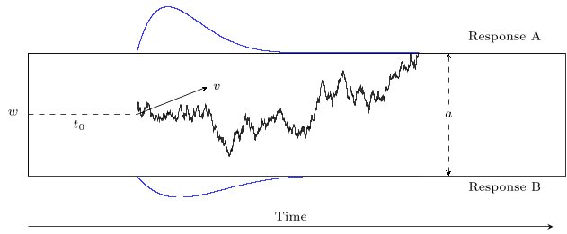

# Wiener Diffusion Model

Diffusion models, sometimes also called Wiener diffusion models, are among the most frequently used model families in modeling two-alternative forced-choice tasks (see @Wagenmaker2009, for a review). Diffusion models allow to model response times and responses jointly. The basic version of a diffusion model comprises four parameters: the boundary separation, $a$, the relative starting point, $w$, the drift rate, $v$, and the non-decision time, $t0$ [@Ratcliff1978]. In the seven-parameter extension of the diffusion model there are the following three parameters added: the inter-trial variability in relative starting point, $s_w$, the inter-trial variability in drift rate, $s_v$, and the inter-trial variability in non-decision time, $s_{t0}$ [@Ratcliff1989].

As a diffusion model describes the decision process for a decision with exactly two choices, there exist reaction time distributions for each response alternative. This means that the probability distribution function ($\text{PDF}$) splits into one part for one response alternative and one part for the other response alternative. In the following, we will refer to one alternative as the _upper response boundary_ and to the other alternative as the _lower response boundary_. The $\text{PDF}$ of the lower response boundary can be obtained when inserting $-v$ and $1-w$ to the $\text{PDF}$ of the upper response boundary. Let's call the $\text{PDF}$ for the lower response boundary $\text{PDF}_0$ and the $\text{PDF}$ for the upper response boundary $\text{PDF}_1$. Then: 

$$
\text{PDF}_0(a,t0,v,w,sv,sw,st0) = \text{PDF}_1(a,t0,-v,1-w,sv,sw,st0)
$$

Usually, a $\text{PDF}$ integrates to 1. In the case of the diffusion model, only the sum of both parts, $\text{PDF}_0$ and $\text{PDF}_1$, integrates to 1. This is called a _defective_.


::: {#fig-DDM}


Figure 1: Realization of a Four-Parameter Diffusion Process Modeling the Binary Decision Process.
 **Note.** The parameters are the boundary separation a for two response alternatives, the relative starting point w, the drift rate v, and the non-decision time t0. The decision process is illustrated as a jagged line between the two boundaries. The predicted distributions of the reaction times are depicted as curved lines below and above the response boundaries (blue).
:::

THE PDF VERSION OF THE IMAGE HAS A MUCH BETTER QUALITY. I DON'T KNOW HOW TO INCLUDE PDF.


The Stan function `wiener_lpdf()` returns the logarithm of the first-passage time density function for a diffusion model with up to seven parameters for upper boundary responses, $\log(\text{PDF}_1)$. Any combination of fixed and estimated parameters can be specified. In other words, with this implementation it is not only possible to estimate parameters of the full seven-parameter model, but also to estimate restricted models such as the basic four-parameter model, or a five or six-parameter model, or even a one-parameter model when fixing the other six parameters.

For example, it is possible to permit variability in just one or two parameters and to fix the other variabilities to 0, or even to estimate a three-parameter model when fixing more parameters (e.g., fixing the relative starting point at 0.5).

It is assumed that the reaction time data $y$ are distributed according to `wiener_lpdf()`:

$$
y \sim \operatorname{wiener\_lpdf}(a, t0, w, v, s_v, s_w, s_{t0})
$$

## Function Call Example

The following example demonstrates a diffusion model call in Stan:

```stan
data {
 int <lower=0> N; // Number of trials
 array[N] real rt; // response times (in seconds )
 array[N] int <lower=0, upper=1> resp; // responses {0 ,1}
}

parameters {
 real <lower=0> a; // boundary separation
 real v; // drift
 real <lower=0, upper=1> w; // relative starting point
 real <lower=0> t0; // non - decision time

 real <lower=0> sv; // variability in drift
 real <lower=0, upper=1> sw; // variability in starting point
 real <lower=0> st0; // variability in non - decision time
}

model {
 // prior distributions of parameters
 a ∼ normal(1, 1);
 w ∼ normal(0.5, 0.1);
 v ∼ normal(2, 3);
 t0 ∼ normal(0.435, 0.12);

 sv ∼ normal(1, 3);
 st0 ∼ normal(0.183, 0.09);
 sw ∼ beta(1, 3);

 // diffusion model
 for (i in 1:N) {
  if (resp[i] == 1) { // upper boundary
   target += wiener_full_lpdf(rt[i] | a, t0, w, v, sv, sw, st0);
  } else { // lower boundary(mirror drift and starting point )
   target += wiener_full_lpdf(rt[i] | a, t0, 1-w, -v, sv, sw, st0);
  }
 }
}
```

### The Data Block

The data should consist of at least three variables:

1. The number of trials N,
2. the response, coded as 0 = “lower bound” and 1 = “upper bound", and
3. the reaction times in seconds (not milliseconds).

Note that two different ways of coding responses are commonly used: First, in _response coding_, the boundaries correspond to the two response alternatives. Second, in _accuracy coding_, the boundaries correspond to correct (upper bound) and wrong (lower bound) responses. 

Depending on the experimental design, one would typically also provide the number of conditions and the condition associated with each trial as a vector. In a hierarchical setting, the **data block** would also specify the number of participants and the participant associated with each trial as a vector. It is also possible to hand over a precision value in the **data block**.


### The Parameters Block

The model arguments of the `wiener_lpdf()` function that are not fixed to a certain value are defned as parameters in the **parameters block**. In this block, it is also possible to insert restrictions on the parameters. Note that the MCMC algorithm iteratively searches for the next parameter set. If the suggested sample falls outside the internally defined parameter ranges, the program will throw an error, which causes the algorithm to restart the current iteration. Since this slows down the sampling process, it is advisable to include the parameter ranges in the defnition of the parameters in the **parameters block** to improve the sampling process (see table below for the parameter ranges). In addition, the parameter space is further constrained by the following conditions:

1. The non-decision time $t_0$ has to be smaller or equal to the observed reaction time: $t0 \leq y$.
2. The varying relative starting point $w$ has to be in the interval (0,1) and thus,

$$
\begin{aligned}
&w + \frac{s_w}{2} < 1 \text{, and} \\
&0 < w-\frac{s_w}{2}
\end{aligned}
$$


|*Parameter* | *Range*      |   |*Parameter*| *Range*     |
|:-----------|:-------------|:--|:----------|:------------|
|$a$         | (0, $\infty$)|   | $y$         |(0, $\infty$)|
|$v$         | (-$\infty$, $\infty$)| | $s_v$ |[0, $\infty$)|
|$w$         | (0,1)        |   | $s_w$     | [0,1)|
|$t_0$       |[0,$\infty$)  |   | $s_{t0}$  |[0,$\infty$)|


### The Model Block

In the **model block**, the priors are defined and the likelihood is called for the upper and the lower response boundary. Different kinds of priors can be specifed here. When no prior is specifed for a parameter, Stan uses default priors. 

Generally, mildly informative priors might help to get the full benefit of a Bayesian analysis.

In the second part of the **model block**, the likelihood function is applied to all responses. Drift rate $v$ and relative starting point $w$ have to be mirrored for responses at the lower boundary.

For more details, see @Henrich2024.


## Truncated and censored data

Truncation and censoring frequently occur in psychological data collection. For reaction time data, truncated and censored data regularly arise in psychological studies as a consequence of using response windows or deadlines. These are sometimes introduced in the analysis of data to exclude reaction times that appear too short or too long, but they are also sometimes already built into the study procedures to push participants to respond within a specifc temporal window.

Depending on the implementation of the response window, two different types of data arise: _truncated_ data or _censored_ data. Since the effects of truncation or censoring on summary statistics such as mean, median, standard deviation, and skewness is regularly too large to ignore [@Ulrich1994], data analysts are well advised to account for these effects.

MAYBE IN THE FOLLOWING PARAGRAPH A LINK TO THE NAMED SUBCHAPTER:

As described in the subchapter "Truncated and Censored Data" in this Users Guide, the cumulative distribution function ($\text{CDF}$) and its complement ($\text{CCDF}$) are needed to model truncated and censored data.

As explained above, the $\text{PDF}$ is defined _defectively_, meaning that only the sum of the $\text{PDF}$s for both response alternatives integrates to 1. For the same reason, the $\text{CDF}$ and $\text{CCDF}$ are also implemented defectively. Analogously, only the sum of the $\text{CDF}$s and $\text{CCDF}$s for both response alternatives converges to 1.

In the case of the diffusion model, the $\text{CDF}$ converges to the probability $P$ to hit the corresponding response boundary: (for simplicity, we omit the inter-trial variabilities in the following)

$$
\begin{aligned}
\text{CDF}_1(\infty\mid a,w,v) &= P(a,w,v) \text{ and} \\
\text{CDF}_0(\infty\mid a,w,v) &= \text{CDF}_1(\infty\mid a,1-w,-v) = P(a,1-w,-v)
\end{aligned}
$$


### Modeling truncated data with the diffusion model

Data are called _truncated_ when there is no information available for analysis from trials with values larger (or smaller) than a right (or left) reaction-time bound. In reaction time experiments, reaction time data are truncated if trials with reaction times outside the response window are excluded from the analysis. Not even a count of those omitted trials is kept.

Let $L$ denote the left reaction-time bound and $U$ denote the right reaction-time bound of a response window.

Then, the density of truncated data for both response boundaries 0 and 1, here denoted as $\text{resp}\in\{0,1\}$, can be formulated as follows:

$$
\begin{aligned}
&\text{PDF}_{\text{resp}}(x \mid L<X\leq U, a, w, v) = \\ &\frac{\text{PDF}_{\text{resp}}(x \mid a, w, v)\cdot \mathbb{I}_{\{L<x\leq U\}}}
{\bigl(\text{CDF}_0(U \mid a, w, v)+\text{CDF}_1(U \mid a, w, v)\bigr) -
\bigl(\text{CDF}_0(L\mid a, w, v)+\text{CDF}_1(L\mid a, w, v)\bigr)}
\end{aligned}
$$

The density of left truncated  data can be formulated as follows:
$$
\begin{aligned}
\text{PDF}_{\text{resp}}(x \mid L<X, a, w, v) = \frac{\text{PDF}_{\text{resp}}(x \mid a, w, v)\cdot \mathbb{I}_{\{L<x\}}}
{1-\bigl(\text{CDF}_0(L \mid a, w, v)+\text{CDF}_1(L \mid a, w, v)\bigr)},
\end{aligned}
$$

and the density of right truncated data can be formulated as follows:

$$
\begin{aligned}
\text{PDF}_{\text{resp}}(x \mid X\leq U, a, w, v) = \frac{\text{PDF}_{\text{resp}}(x \mid a, w, v)\cdot \mathbb{I}_{\{x\leq U\}}}{\text{CDF}_0(U \mid a, w, v)+\text{CDF}_1(U \mid a, w, v)}
\end{aligned}
$$


As the functions are implemented defectively, a truncated diffusion model cannot be calculated with the truncation functor $T[,]$ as it would usually be done in Stan. This means the function call: `x ~ wiener(...)T[L,U]` does not work the way it is supposed to. When the truncation functor is called in Stan, Stan searches for a CDF implementation internally. In the case of the diffusion model, Stan would find the CDF, but is not aware of its defective implementation and calculates the computations as if it were a non-defective CDF. This causes misleading and incorrect results. 

Therefore, to implement the truncated model, write out the function shown above on the log-scale with `left_bound = L` and `right_bound = U`, where `wiener_lcdf_unnorm()` calls the
logarithmized CDF of the diffusion model at the response-1-boundary:

```stan
model { // compute the denominator on log scale
 real denom = log_diff_exp(
  log_sum_exp(
   wiener_lcdf_unnorm(right_bound | a, t0, w, v, sv, sw, st),
   wiener_lcdf_unnorm(right_bound | a, t0, 1-w, -v, sv, sw, st)),
  log_sum_exp(
   wiener_lcdf_unnorm(left_bound | a, t0, w, v, sv, sw, st),
   wiener_lcdf_unnorm(left_bound | a, t0, 1-w, -v, sv, sw, st))
 ); // parenthesis log_diff_exp
 // compute log - likelihood
 for (i in 1:N) {
  if (resp[i] == 1) { // response -1 boundary
   target += wiener_lpdf (rt[i] | a, t0, w, v, sv, sw, st);
  } else { // response -0 boundary ( mirror v and w)
   target += wiener_lpdf (rt[i] | a, t0, 1-w, -v, sv, sw, st);
  }
   target += -denom ;
 } // end for
}
```

How to call a truncated model within the parallelization routine of `reduce_sum`or with truncation to only on side, see @Henrich2026.


### Modeling censored data with the diffusion model

Data are _censored_ when observations that are above or below a right or left boundary value are reported as occurrences of the event $(x > U)$, for $U$ the right bound, or as occurrences of the event $(x \leq L)$, for $L$ the left bound, respectively. Like for truncated data, the range of the possible values is restricted, but the number of observations that fall outside the boundaries is kept, whereas in truncation, no count would be kept.

For the censored model, we distinguish two cases: In the first case, the responses of the censored trials are known, but the reaction times are not known. In the second case, neither the responses nor the reaction times of the censored trials are known. Note that the second case differs from a truncated model in the fact that the number of censored trials is still known. Consider first the case where the response is known even for censored data.

To model such data in Stan, the left and right reaction time bounds, `left_bound` and `right_bound`, respectively, are handed over in the **data block**, as well as a vector `censored` that tracks whether a trial is censored (= 1) or not (= 0), and counts of trials censored at the left reaction time bound and counts of trials censored at the right reaction time bound for each response in {0,1}. There are four such count variables: `N_cens_left_0`, `N_cens_left_1`, `N_cens_right_0`, `N_cens_right_1`:


```stan
model { // ... // definition of priors for all model parameters
 for (i in 1:N) {
  if (resp[i] == 1) { // response-1 boundary
   if (censored[i] == 0) {
    x[i] ∼ wiener(a, t0, w, v, sv, sw, st0);
   }
  } else if (resp[i] == 0) { // response-0 boundary
   if (censored[i] == 0) {
    x[i] ∼ wiener(a, t0, 1-w, -v, sv, sw, st0);
   } // end if
  } // end else if
 } // end for
 
 // summands for response = 0
 target += N_cens_left_0 * wiener_lcdf_unnorm(left_bound | a, t0, 1-w, -v, sv, sw, st0);
  
 target += N_cens_right_0 * wiener_lccdf_unnorm(right_bound | a, t0, 1-w, -v, sv, sw, st0);
  
 // summands for response = 1
 target += N_cens_left_1 * wiener_lcdf_unnorm(left_bound | a, t0, w, v, sv, sw, st0);
  
 target += N_cens_right_1 * wiener_lccdf_unnorm(right_bound | a, t0, w, v, sv, sw, st0);
}
```

When data are censored at only one side, omit the lines for the other side in the code.

When data consist of many conditions, it is sometimes more convenient to loop over all trials instead of using count variables as described above, using the following notation and code. A vector containing the information whether a trial is censored or not, here `censored`, needs to be handed over in the **data block**. This vector splits the data into three bins: all trials $i$ with `censored[i]=0` are censored below the left reaction time bound, all trials $i$ with `censored[i]=1` fall between the reaction time bounds, and all trials $i$ with `censored[i]=2` are censored above the right reaction time bound. For non-censored trials, the log-PDF is computed, for left censored trials, the log-CDF is computed, and for right censored trials, the log-CCDF is computed:


```stan 
model { // ... // definition of priors for all model parameters
 for (i in 1:N) { // right censored at right_bound
  if (resp [i] == 1) { // upper response boundary
   if (censored[i] == 1) {
    target += wiener_lpdf(x[i] | a, t0, w, v, sv, sw, st0);
   } else if (censored[i] == 0) {
    target += wiener_lcdf_unnorm(left_bound | a, t0, w, v, sv, sw, st0);
   } else if (censored[i] == 2) {
     target += wiener_lccdf_unnorm(right_bound | a, t0, w, v, sv, sw, st0);
   }
  } else { // lower response boundary (mirror drift and
 // starting point!)
   if (censored[i] == 1) {
    target += wiener_lpdf(x[i] | a, t0, 1-w, -v, sv, sw, st0);
   } else if (censored[i] == 0) {
    target += wiener_lcdf_unnorm(left_bound | a, t0, 1-w, -v, sv, sw, st0);
   } else if (censored[i] == 2) {
    target += wiener_lccdf_unnorm(right_bound | a, t0, 1-w, -v, sv, sw, st0);
   }
  }
 }
}
``` 

When the data are censored to only one side, omit the case that is not needed.

Note that this block can be inserted in the defnition of the parallelization function, `partial_sum_wiener()`, as defined below.

Censoring sometimes includes the response (i.e., it is known that the reaction time in a trial fell outside the response window, but which response was given is unknown). One method that has been used to model such data has involved inferring the numbers of missing responses of either kind from the observed relative frequencies of the two responses. This approach has the problem that quite specifc assumptions on the missing data have to be made (namely, that the proportions of the two kinds of responses are the same for responses within and outside the response window).

Here is a more principled approach that uses the cumulative distribution functions and their complements to provide the likelihood of censored data. As before, let $L$ be the left reaction time bound, and $U$ the right reaction time bound, and consider decision times without inter-trial variabilities for the sake of simplicity. It follows that the likelihood $p_l$ of observing a left-censored data point
is given by

$$
\begin{aligned}
p_l(a,w,v) = \text{CDF}_0(L\mid a,w,v) + \text{CDF}_1(L\mid a,w,v),
\end{aligned}
$$

whereas the likelihood $p_r$ of a right-censored data point is given by

$$
\begin{aligned}
p_r(a,w,v) = \text{CCDF}_0(U\mid a,w,v) + \text{CCDF}_1(U\mid a,w,v).
\end{aligned}
$$


See the following code for an example of Stan code implementing this second case of censoring. This model call deals with the problem of unknown responses by computing the probability of choosing the response-1- or response-0 boundary outside the response window. Here, the CDF and/or the CCDF are required, depending upon whether there is only left-censoring, right-censoring, or censoring both to the left and to the right. The following code shows the **functions block** for a model that is right-censored using the function `partial_sum_wiener()` for parallel computations. Combine this block with the **model block** in the example above:

```stan 
functions { // parallelization function
 real partial_sum_wiener(array[] real rt_slice, int start,
 int end, real a, real t0, real w, real v, real sv, real sw,
 real st, array[] int resp, real right_bound,
 array[] int censored) {
  real ans = 0;
  for (i in start : end) {
   if (censored[i] == 1) { // not censored data
    if (resp[i] == 1) { // upper boundary
     ans += wiener_lpdf(rt_slice[i+1- start ] | a, t0, w, v, sv, sw, st);
    } else { // lower boundary(mirror v and w)
     ans += wiener_lpdf(rt_slice[i+1- start ] | a, t0, 1 - w, -v, sv, sw, st);
    } 
   } else { // censored data
    ans += log_sum_exp (
     wiener_lccdf_unnorm(right_bound | a, t0, w, v, sv, sw, st),
     wiener_lccdf_unnorm(right_bound | a, t0, 1-w, -v, sv, sw, st);
   }
  } // end for
  return ans;
 } // end partial_sum_fullddm
} // end functions
```

For more details, see @Henrich2026.


